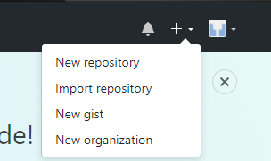
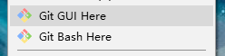
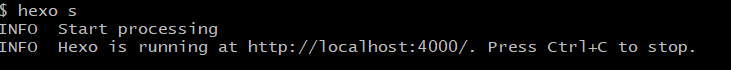

虽然是软件工程专业的学生，但其实最近才接触的这方面的知识。

说到建站，很多人想到的是服务器和域名的租赁，换句话讲就是大笔的金钱。

然而其实[Github](https://github.com/)有一个叫做[GitHub Pages](https://pages.github.com/)的功能，能够让你免费搭建一个属于自己的网站。

本篇文章是我在学习搭建网站后，结合网络的教程自己简化的的一个版本，仅供我自己参考。

其次，本篇文章讲的是GitHub与hexo合作搭建网站，并没有关于Jekyll的内容......

只适用于Windows系统......


## 建站前的准备

### 什么是Github？

~~这段内容并不是重点......~~

简单的说就是一个位开发者提供Git仓库共享的托管服务。是一个能让所有人共享代码的好地方。

### 注册一个GitHub账户

其实并没有什么好说的......

### 新建一个仓库



选择New repository，在Repository name那栏填上yourname.github.io（这是GitHub pages的固定格式）。

yourname与前面owner相同。

下方的description可以不填，选择public~~（没钱选private）~~然后点Create repository，至此就完成了仓库的创建。

### 下载msysgit

[下载地址](https://gitforwindows.org/)

安装方法就是一路next点到底，中间环境变量选择时请选择Use Git Bash Only，这样比较有13格嘿嘿嘿。

右键桌面出现代表安装完成。

### 一些设置（在Git Bash中设置）

+ 设置使用git时的姓名和邮箱地址，名字用英文。

``` bash
$ git config --global user.name "Firstname Lastname"
$ git config --global user.email "your_email@example.com"
```

这个命令，会在“~/.gitconfig”中以如下形式输入设置文件。

```
[user]
  name = Firstname Lastname
  email = your_email@example.com
```

可以直接在文件中修改信息，可使用昵称而不是真实姓名。

+ 设置SSH Key

总之需要这个东西进行认证，手打的有点酸了，以后再解释......嘿嘿嘿

运行下面的命令来创建 SSH Key。


```bash
$ ssh-keygen -t rsa -C "your_email@example.com"
```

回车，屏幕上会出现


```bash
Generating public/private rsa key pair.
Enter file in which to save the key
(/Users/your_user_directory/.ssh/id_rsa):
```

回车

```
Enter passphrase (empty for no passohrase): 输入密码
Enter same passphrase again: 再次输入密码
```

输入密码后会出现一下结果

```
Your identification has been saved in /Users/your_user_directory/.ssh/id_rsa.
Your public key has been saved in /Users/your_user_directory/.ssh/id_rsa.pub.
The key fingerprint is:
(fingerprint值)your_email@example.com
The key's randomart image is:
略
```

id_rsa文件是私有密钥，id_rsa.pub是公开密钥

+ 在Github中添加公开密钥


点击右上角的账户设定（Account Settings），选择SSH Key

点击Add SSH Key，出现title和key两个输入框

在Title中输入恰当的密钥名称

Key中粘贴id_rsa.pub文件中的内容

id_rsa.pub中的内容可用如下方式查看。


```bash
$ cat ~/.ssh/id_rsa.pub
```

添加成功之后，创建账户时所用的邮箱就会收到邮件提示。

完成设置后，验证。

```bash
$ ssh -T git@github.com
```

 跳出提示后输入yes

 出现如下结果即为成功。

```
Hi yourname! You've successfully authenticated, but GitHub does not provid shell access.
```

### 安装Node.js

[下载连接](http://nodejs.cn/)

emmm......

### 用npm指令安装Hexo

```bash
npm install -g hexo-cli
```

### Hexo的配置

在任意一个文件夹下（自己建一个）用bash命令建立一个终端

```bash
$ hexo init
```

这时候输入

```bash
$ hexo generator
$ hexo server
```

当其出现下图所示即为创建完毕



此时打开任意浏览器

输入localhost:4000可查看网页

### 上传至GitHub

上述步骤只是让你能在本地浏览网页

如何在任意一台机子上查看呢

```bash
$ hexo deploy
```

这个命令能将hexo同步至GitHub上你所创建的仓库中

但在此之前，还有一个小的设置

在本地的hexo终端

也就是你创建的那个文档中

找到根目录下的_config.yml文件

将最后的deploy那里改为

```
deploy:
  type: git
  repo: https://github.com/yourname/yourname.github.io.git
  branch: master
```

保存后在执行之前的deploy命令即可

然后你就可以用yourname.github.io这个域名（？）在任意电脑上访问你的网站。


***


PS.几个小的备注

1.hexo是可以更换主题模板的

[地址](https://hexo.io/themes/)

2.每次更换Hexo主题都要记得先clean一下在generator和deploy

```bash
$ hexo clean
```

